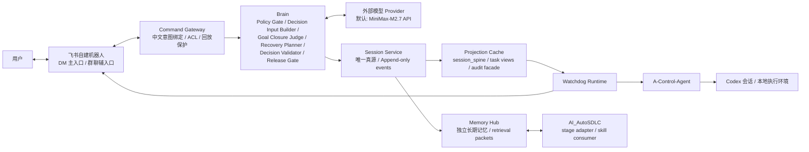

# Codex 长时运行自治架构设计

- 状态：Draft for adversarial review
- 日期：2026-04-10
- 目标主题：`Long-running Autonomy`
- 关联文档：
  - `docs/plans/2026-04-10-runtime-env-and-unknown-decision-rca.zh-CN.md`
  - `docs/architecture/openclaw-codex-watchdog-full-product-loop-design.md`
  - `docs/openapi/a-control-agent.json`
  - `docs/openapi/watchdog.json`

## 1. 设计目标

本设计只服务一个目标：

> 建立一套不依赖 OpenClaw、能够借助外部模型辅助 Codex 长期执行开发任务、减少中断、减少人工盯守的单控制面系统。

本设计的收敛结果固定为：

- 主链路中移除 `OpenClaw`；
- 只保留一套开发环境，不再维护“开发环境 + 外部运行环境”双环境；
- 用 `Feishu` 自建机器人作为唯一的人类交互入口；
- 用外部模型辅助自动决策，但不把权限边界直接交给模型；
- 建立独立的 `Session Service` 与 `Memory Hub`，让任务在会话中断、切换新会话、跨项目演进时仍可延续。

## 2. 范围与非目标

### 2.1 本轮范围

- `A-Control-Agent` 与 `Watchdog` 保留并重构职责；
- 新增 `Session Service`，作为唯一业务真源；
- 新增 `Brain`，负责外部模型辅助决策；
- 新增 `Memory Hub`，负责独立长期记忆；
- 飞书机器人负责中文可读的通知、问答、人工审批与接管；
- 高频会话中断类问题走“冻结交接包 -> 新会话接续”；
- 全部正式产物和后续关键实现均通过两轮对抗评审。

### 2.2 明确非目标

- 不再设计任何 `OpenClaw` 主链路；
- 不把 `ChatGPT` 订阅网页会话当作可编程后端；
- 不在第一阶段实现企业级多租户控制面；
- 不在第一阶段开放高风险动作的自动批准；
- 不让 `Memory Hub` 直接替代运行时热路径状态。

## 3. 设计原则

### 3.1 单一事实来源

所有关键业务事实必须先写入 `Session Service`。  
`Watchdog session_spine`、`tasks_store`、`audit views` 只允许作为 projection、兼容层或查询 facade 存在，不能再与新系统并行担任真源。

### 3.2 Brain 与 Hands 解耦

- `Brain` 负责判断，不执行；
- `Hands` 负责执行，不解释；
- `Feishu` 只做人机交互；
- `Memory Hub` 只提供长期记忆与检索；
- `Session Service` 负责事实与顺序语义。

### 3.3 目标闭合判断必须模型化，但安全边界必须规则化

是否还有下一步开发任务，经常不是显式文本能表达清楚的，因此不能只靠硬规则判断 `continue` 或 `complete`。  
但审批、高风险操作、越权动作、会话恢复预算等边界必须由规则系统约束。

### 3.4 中断恢复优先于重试

对 `remote compact disconnect` 一类高频平台性故障，默认策略不是“继续重试旧会话”，而是：

`冻结交接包 -> 启动新会话 -> 提交 lineage -> 再决定是否自动继续`

### 3.5 长期记忆独立存在

长期记忆库必须独立于 Codex、OpenClaw 和 SDLC 框架本身。  
它可以被它们统一索引，但不属于任何单个运行时。  
实现形态可以是 `embedded library`、本地 sidecar 或共享 daemon，但必须对外暴露稳定的 write / search / packet / skills contract。  
不过第一阶段的成败标准不能偏移：`Memory Hub` 的首要职责，仍然是支撑 Codex 长时自动开发，而不是先做成一个脱离主线的通用记忆产品。

### 3.6 透明可解释

每次自动决策都必须能回答这 5 个问题：

- 发生了什么；
- 模型看了哪些上下文；
- 做了什么判断；
- 判断依据是什么；
- 系统已经执行了什么。

## 4. 目标架构



## 5. 核心组件与职责

### 5.1 Hands

`Hands` 是执行面集合，至少包括：

- `Codex` 会话；
- `A-Control-Agent` 的 canonical 读取与动作接口；
- `Watchdog` 执行 worker；
- `Feishu sender`；
- 本地 shell / worktree / git / 文件系统执行器。

`Hands` 只执行已经被创建并验证过的命令，不直接做长链路规划判断。

### 5.2 Session Service

`Session Service` 是唯一业务真源，采用 append-only 事件模型。

它必须记录：

- 用户输入；
- 任务目标与 Goal Contract；
- 模型决策；
- 命令生命周期；
- 审批与人工覆盖；
- 记忆降级、记忆冲突与热路径退化；
- 会话中断、handoff、新会话接续；
- 飞书通知与用户回执；
- 会话 lineage。

#### 5.2.1 基础业务事件

- `goal_contract_created`
- `goal_contract_revised`
- `goal_contract_adopted_by_child_session`
- `decision_proposed`
- `decision_validated`
- `command_created`
- `command_claimed`
- `command_lease_renewed`
- `command_claim_expired`
- `command_requeued`
- `command_executed`
- `command_failed`
- `approval_requested`
- `approval_approved`
- `approval_rejected`
- `approval_expired`
- `stage_goal_conflict_detected`
- `memory_unavailable_degraded`
- `memory_conflict_detected`
- `notification_announced`
- `notification_delivery_succeeded`
- `notification_delivery_failed`
- `notification_requeued`
- `notification_receipt_recorded`
- `interaction_context_superseded`
- `interaction_window_expired`
- `human_override_recorded`

#### 5.2.2 恢复事务事件

- `recovery_tx_started`
- `handoff_packet_frozen`
- `child_session_created`
- `lineage_committed`
- `parent_session_closed_or_cooled`
- `recovery_tx_completed`

#### 5.2.3 会话 lineage 关系

- `supersedes`
- `forks_for_recovery`
- `forks_for_parallel_subtask`
- `resumes_after_interruption`

任何新会话必须带：

- `parent_session_id`
- `source_packet_id`
- `recovery_reason`
- `goal_contract_version`

#### 5.2.4 Session Identity 与唯一写入闸门

从目标架构开始，`session_id` 不再等同于 `project_id`。  
一个项目可以拥有多个会话，`project` 只持有当前 head session、历史 session 集合与 lineage 图。

因此必须明确以下不变量：

- 每个 `session_id` 全局唯一；
- 每个 `project_id` 可关联多个 `session_id`；
- 旧的“`session:{project_id}` 稳定线程视图”只能作为 projection，不再代表真实 session identity；
- 任何 parent/child 接续必须通过 `lineage_committed` 显式建立关系，而不是靠覆盖 `current_thread_id`。

#### 5.2.5 Session Service Write Barrier And Invariants

`Session Service` 不是普通日志汇总器，而是唯一写前置闸门。  
任何 side effect 在业务上生效前，必须先有对应的真相事件写入成功。

必须固定以下约束：

- `goal_contract_created`、`goal_contract_revised`、`goal_contract_adopted_by_child_session` 写入成功前，不允许 `Brain`、`Policy Gate` 或恢复流程使用新的 contract version；
- 任何 `Goal Contract` 的物化快照、查询缓存或独立 service 都只能从最新 Session event version 重建，不允许反向覆盖当前有效 version；
- `decision_proposed` 与 `decision_validated` 写入成功前，不允许创建可执行命令；
- `command_created` 写入成功前，不允许 Hands 执行任何命令；
- `command_claimed` 写入时必须同时冻结 `worker_id` 与 `lease_expires_at`；
- 旧 claim 未 `command_claim_expired` 或未显式 `command_requeued` 前，不允许第二个 worker 抢占同一命令；
- `approval_requested` 写入成功前，不允许向人类发出可确认的审批请求；
- `approval_approved`、`approval_rejected`、`approval_expired` 写入成功前，不允许解除、拒绝或关闭对应审批阻塞；
- `notification_announced` 写入成功前，不允许把“已经执行/已经决策”发给飞书；
- `notification_delivery_succeeded` 写入成功前，不允许把该通知视为“已送达用户”；
- `notification_delivery_failed` 或 `notification_requeued` 未写入前，不允许静默丢弃发送失败；
- `notification_receipt_recorded` 写入成功前，不允许把用户交互窗口标记为已响应；
- `interaction_context_superseded` 写入成功前，不允许让新的交互上下文替代旧上下文成为当前有效入口；
- `interaction_window_expired` 写入成功前，不允许把过期窗口静默回收或继续接受回复；
- `human_override_recorded` 写入成功前，不允许覆盖当前风险、目标或执行状态；
- `recovery_tx_started` 与 `handoff_packet_frozen` 未提交前，不允许创建子会话；
- `lineage_committed` 未成功前，不允许把 parent session 标记为已接管完成。

必须固定以下幂等与去重键：

- 普通命令：`command_key = session_id + command_kind + packet_hash + policy_version`
- 恢复事务：`recovery_key = parent_session_id + failure_family + failure_signature`
- 飞书控制命令：`interaction_key = interaction_context_id + actor_id + normalized_intent`
- 通知投递尝试：`notification_attempt_key = interaction_context_id + target_actor + delivery_channel + attempt_ordinal`
- 交互族唯一键：`interaction_family_key = session_id + related_event_id + target_actor + intent_family`

必须固定以下消费者纪律：

- 执行 worker 只消费 Session projection，不直接读旧 store 判定执行资格；
- 任何旧存储只允许做兼容回填、排障查询或 projection 构造；
- 审批、通知、人工覆盖状态只允许从 Session projection 派生，不允许再维护独立的业务真源；
- 若写入真相事件失败，必须 fail closed，不能“先执行再补事件”。

#### 5.2.6 Session Store Concurrency And Atomicity

如果第一阶段仍使用本地 JSON / 文件型 append store，必须把并发与崩溃一致性写成硬约束，而不是实现细节：

- 同一 `session_id` 在任意时刻只能由单 writer 持有写锁；
- 事件序号必须单调递增，不能因并发写入产生乱序或重复序号；
- append 操作必须具备原子提交语义，至少保证“整条事件成功写入”或“完全不落盘”；
- writer 必须维护可恢复的幂等索引，进程崩溃后重启仍能识别已提交事件；
- 若锁丢失、索引损坏或原子写入前提不满足，系统必须 fail closed，而不是退回无锁追加。

#### 5.2.7 Command Lease And Delivery Recovery Protocol

“先写真相再执行”还不够，执行面与交互面必须处理好中间态故障，否则系统会卡死在 `claimed/pending` 幻觉状态。

必须固定以下协议：

- `command_claimed` 只是“某个 worker 取得租约”，不是“命令已稳定执行”；
- claim 记录必须携带 `worker_id`、`claimed_at`、`lease_expires_at`；
- worker 在长执行期间必须周期性写 `command_lease_renewed`；
- 若在租约到期前没有出现 `command_executed` 或 `command_failed`，协调器必须写入 `command_claim_expired`，再决定 `command_requeued` 或升级为恢复/人工处理；
- 终态事件只接受当前有效 claim owner 提交，过期 worker 的晚到结果不得直接覆盖当前状态；
- `notification_announced` 只表示“系统需要向人发消息”，不等于“消息已经送达”；
- 投递器必须为每次发送尝试写入 `notification_delivery_succeeded`、`notification_delivery_failed` 或 `notification_requeued`；
- 用户回复窗口过期时必须写入 `interaction_window_expired`，过期回复只能进入审计记录，不得直接改变审批或 override 状态；
- 一期 release gate 必须覆盖 worker crash、claim timeout、通知发送失败、requeue、stale interaction 与人工接管场景。

### 5.3 Projection Cache

现有运行态存储不立即删除，而是降级为 projection / cache：

- [`src/watchdog/services/session_spine/store.py`](/Users/sinclairpan/project/openclaw-codex-watchdog/src/watchdog/services/session_spine/store.py)
  - 从“当前每项目最新快照真源”降级为 `Session Service` 的 projection cache；
- [`src/a_control_agent/storage/tasks_store.py`](/Users/sinclairpan/project/openclaw-codex-watchdog/src/a_control_agent/storage/tasks_store.py)
  - 在迁移阶段作为兼容层与 Goal Contract bootstrap 来源；
- [`src/watchdog/services/approvals/`](/Users/sinclairpan/project/openclaw-codex-watchdog/src/watchdog/services/approvals/)
  - 从“审批状态真源”降级为 Session projection 的兼容读写外观与 inbox cache；
- [`src/watchdog/services/delivery/store.py`](/Users/sinclairpan/project/openclaw-codex-watchdog/src/watchdog/services/delivery/store.py)
  - 只保留通知 envelope、投递重试与回执消费，不再定义业务状态是否已生效；
- [`src/watchdog/services/audit/service.py`](/Users/sinclairpan/project/openclaw-codex-watchdog/src/watchdog/services/audit/service.py)
  - 逐步收敛为 Session query facade。

### 5.4 Brain

`Brain` 是决策层，不是执行层，也不是新的事实层或 prompt/runtime 中枢。它至少拆成 8 个子能力：

- `Policy Gate`
  - 硬边界、风险等级、审批要求、恢复预算；
- `Decision Input Builder`
  - 从 Session、runtime snapshot、Goal Contract 与 Memory Hub refs 生成 versioned `decision_packet_input`；
  - 只输出 summary、retrieval refs、expansion handles、hashes 与 provenance，不拥有最终 prompt/messages 组装权；
- `Goal Closure Judge`
  - 判断是子任务完成、候选完成，还是整个目标完成；
- `Recovery Planner`
  - 判断是否需要 handoff、开新会话、恢复后继续；
- `Decision Validator`
  - 校验模型输出 schema、风险边界、幂等性与执行资格。
- `Provider Certification`
  - 认证 inference provider 与 memory adapter contract，但不负责 provider 选择、切换或 lifecycle；
- `Historical Replay`
  - 同时支持冻结 packet replay 与基于 canonical events 的语义 replay；
- `Release Gate`
  - 只负责低风险自动决策资格校验，不是平台总闸门。

第一期不允许只交付“Session/Memory/Feishu 外壳”而缺失决策闭环。  
在架构层面，以下能力缺一不可，否则不得宣称进入可上线自治状态：

- `Policy Gate`
- `Decision Input Builder`
- `Goal Closure Judge`
- `Recovery Planner`
- `Decision Validator`
- `Provider certification`
- `historical packet replay`
- `low-risk auto-decision`

同时必须冻结以下硬边界：

- `Brain` 的 packet、summary、report、trace 都是 derived artifacts，不得成为审批、完成态、恢复态或执行态真相；
- `Brain` 只输出声明式 `DecisionIntent`，不得直接 claim lease、执行工具、写 session 终态或修改 approval state；
- `Decision Input Builder` 不是 prompt builder，最终 prompt/messages/tool schema 仍由调用侧 harness 组装；
- 风险带、审批要求与完成判定只由 `Policy rules + Session facts + Goal Contract` 决定，memory recall、skills、User Model 与 provider confidence 都不得降级风险或绕过审批；
- `release_gate_report` 只约束 low-risk auto-decision；报告缺失、过期或哈希不一致时，一律自动降级到 `suggest-only` 或人工路径。

### 5.5 Memory Hub

`Memory Hub` 必须被实现为独立开发、独立演进的记忆系统。  
它不是会话真源，也不负责当前热路径状态，但必须可被 `watchdog`、`AI_AutoSDLC` 以及未来其他 agent 统一检索。

它的角色边界固定为：

- `Session Service` 负责运行时真相；
- `Goal Contract` 负责当前目标治理；
- `Memory Hub` 负责长期记忆、检索、技能发现与跨会话复用；
- `User Model` 只允许做辅助排序和表达偏好，不得参与审批、安全和风险决策。

它的第一阶段成功标准固定为：

- 能支撑 Codex 因 `remote compact`、线程切换、跨会话 handoff 导致的长时开发连续性；
- 能把项目事实、恢复案例、技能候选稳定提供给 Brain/Decision Input Builder；
- 能为 `AI_AutoSDLC` 保留兼容的 stage-aware packet schema，但不把该入口纳入一期放行门槛；
- 四层记忆都只交付服务于“接续、自动决策、技能复用、解释性”的最小可用切片，不先做通用知识平台；
- 如果某项功能不能提升“接续、自动决策、技能复用、解释性”这四件事，就不进入第一期。

#### 5.5.1 四层记忆模型

`Memory Hub` 采用四层结构，避免把所有信息都塞进常驻上下文：

1. `Resident Prompt Memory`
   - 常驻提示记忆，编译成类似 `MEMORY.md` / `USER.md` 的会话启动胶囊；
   - 只保留每次会话都需要加载的稳定约束、当前项目关键事实、持久用户偏好；
   - 必须有严格预算上限，默认按 Hermes 的收紧思路执行，不允许无限膨胀；
   - 不写入原始 transcript，不允许存放未经治理的自由总结。

2. `Session Archive Memory`
   - 保存跨会话 transcript、事件、artifact、handoff、RCA、恢复案例；
   - 底层可用 `SQLite + FTS + blob refs` 或等价本地索引方案；
   - 只在当前任务需要历史上下文时按需检索，并在注入前做相关性摘要；
   - 面向 Codex、Cursor、Feishu 以及受控聊天入口统一建档。

3. `Skill Memory`
   - 保存学习循环产出的技能资产；
   - 默认只把 `name + short description + verification metadata` 放入上下文；
   - 技能全文在 capability 匹配后按需调入；
   - 生命周期固定为 `candidate -> verified -> shared -> deprecated`。

4. `User Model Memory`
   - 记录长期沟通风格、领域偏好、常用工作方式；
   - 仅作为辅助层参与检索排序、解释风格和 skill 推荐；
   - 不得改变权限、审批、Goal Contract 核心字段和风险级别。

#### 5.5.2 Memory Ingestion And Promotion Pipeline

`Memory Hub` 不能靠“模型顺手写个总结”来喂养，必须有明确的摄取流水线。  
长期看，Codex 与 `AI_AutoSDLC` 项目内容都应通过统一流水线写入独立记忆仓；但第一期只强制落地 `watchdog/Codex` 主路径，其余入口可以先冻结 adapter contract：

1. `Project Registrar`
   - 当项目首次被纳入控制面时，生成稳定 `project_id` 与项目指纹；
   - 建立项目元数据、仓库根路径、远端信息、默认约束、当前 head session 关系。

2. `Workspace Baseline Scanner`
   - 首次注册时执行一次基线扫描；
   - 对项目代码、文档、配置、测试、关键脚本建立文件清单、内容哈希、路径索引、语言类型、目录归属；
   - 二进制大文件、依赖目录、缓存目录只建 manifest，不做全文入库；
   - 明显包含凭证的文件默认只记元数据，不存原文。

3. `Runtime Adapter Ingest`
   - `watchdog/Codex` 一期必须先走受控 adapter 再进入统一 ingestion contract；`AI_AutoSDLC`、`Cursor`、`Feishu` 等入口可以先保留 preview compatibility adapter；
   - ChatGPT 日常对话如需接入，只允许通过可控入口，例如 API、代理、转发机器人或导出导入，不假定网页 UI 可被稳定采集；
   - adapter 必须显式标注 `source_runtime`、`source_actor`、`source_scope`、`capture_mode`。

4. `Session Event Writer`
   - 运行期所有会话事件先进入 `Session Service`；
   - 再由异步 ingest worker 写入 archive index 与 normalized facts；
   - 包括用户指令、模型决策、命令执行、审批、handoff、通知、人工覆盖。

5. `Transcript Archiver`
   - 会话原文不直接塞进热路径表；
   - 按 `session_id / turn_id / chunk_id` 归档为 transcript blobs；
   - 数据库存索引、摘要、哈希、来源、时间、关联 packet。

6. `Incremental Workspace Indexer`
   - 每次 `command_executed`、`handoff_packet_frozen`、`goal_contract_revised`、`final_summary_emitted` 后触发；
   - 只处理变更文件，而不是全量重扫项目；
   - 记录变更前后哈希、触达 session、触达 task、文件摘要、语言与路径索引。

7. `Document And Artifact Ingestor`
   - 对 handoff、RCA、设计文档、阶段总结、测试结果、最终交付物建立独立 artifact 记录；
   - 文档正文与结构化元数据分开存；
   - 后续允许构建全文检索和语义检索，但不作为第一阶段热路径依赖。

8. `Skill Extractor And Promoter`
   - 从成功交付、恢复案例、标准流程中提取候选技能；
   - 候选技能必须经过抽象化、参数化、风险审查和验证后，才允许进入 `verified/shared`；
   - 跨项目可见性默认关闭，只有通过推广流程的技能才能从 `project-local` 升级为 `workspace-family` 或 `global-shared`。

9. `Periodic Nudge Worker`
   - 在没有用户输入时，系统允许周期性触发内部复盘；
   - 它只能生成“记忆候选 / 技能候选 / 用户画像候选”，不能直接覆盖 resident memory、Goal Contract 或安全配置；
   - 任意自动提炼结果都必须经过去重、冲突检查和治理规则后再落库。

10. `Packet Materializer`
   - 从 Session、workspace、documents、recovery cases 派生 `retrieval_packets`；
   - packet 是面向消费场景的派生物，不是原始真相。

#### 5.5.3 写入粒度、作用域与存储纪律

必须固定以下纪律：

- 不是“每轮把整个项目写一次”，而是“首次基线建档 + 后续增量摄取”；
- 原始代码文件以内容哈希为主键去重，避免重复保存；
- 作用域必须区分：
  - `project-local`
  - `workspace-family`
  - `global-shared`
- 数据库存储索引、元数据、关系、摘要；
- 长文本、会话原文、文档正文、文件快照进入 blob store；
- 任意记忆条目都必须带 provenance：
  - `project_id`
  - `session_id`
  - `task_id`
  - `source_runtime`
  - `source_kind`
  - `source_ref`
  - `source_scope`
  - `captured_at`
  - `content_hash`
  - `freshness_ttl`
  - `last_verified_at`
- 任何来源不明、无法归属项目、无法确认时间顺序的数据，不得进入 canonical memory。
- 任意跨项目共享技能如果没有 `verification metadata` 和回滚信息，不得进入 `global-shared`。

#### 5.5.4 Codex 与 AI_AutoSDLC 的调用契约

`Memory Hub` 对外只暴露稳定 contract，不允许业务方直接读内部存储表。

`AI_AutoSDLC` 的调用契约在第一期只冻结兼容 schema，不进入一期 release gate；一期放行只看 `watchdog/Codex` 主链路是否闭环。

`watchdog/Codex` 侧的调用至少应提供：

- `project_id`
- `session_id`
- `goal_contract_version`
- `decision_context`
- `current_workspace_delta`
- `requested_packet_kind`

`AI_AutoSDLC` 侧的调用至少应提供：

- `project_id`
- `repo_fingerprint`
- `stage`
- `task_kind`
- `capability_request`
- `active_goal`

其中：

- `stage` 与 `active_goal` 在 `Memory Hub` 中只代表请求上下文，不代表运行时真相；
- 当前是否允许推进、阶段是否已完成，仍由 `Goal Contract + Brain + Policy Gate` 判定；
- 若 `stage/active_goal` 与当前 `Goal Contract` 冲突，必须显式记录 `stage_goal_conflict_detected`，并把返回结果降级为参考信息。

`Memory Hub` 的返回必须至少包含：

- resident capsule；
- 相关 archive summary；
- recovery cases；
- candidate / verified / shared skills；
- 每个返回字段的 provenance、scope、freshness、trust tier。

决定“是否执行”“是否越权”“是否完成”的责任仍然在 Brain、Policy Gate 和 Goal Contract，不在 `Memory Hub`。

#### 5.5.5 第一期 Release Scope

`Memory Hub` 的第一期必须按“Codex-critical MVP”收口，不能把未来平台化能力全部绑进 release gate。

第一期必须完成：

- `watchdog/Codex` 的稳定 ingest、resident capsule、archive retrieval、recovery case 检索、packet materialization；
- `project-local skill` 与 `verified shared skill` 的读取、匹配和安全降级；
- `Memory Hub` 不可用、冲突、陈旧时的安全退化路径。

第一期可以保留 contract 或 preview，但不是 release blocker：

- `AI_AutoSDLC` 的 stage-aware packet 读取 contract；
- `Cursor` 与受控聊天入口的实时 ingest；
- `User Model Memory` 的长期画像充实；
- `Periodic Nudge` 的自动推广；
- 候选 skill 的自动跨项目推广；
- 面向通用 agent 平台的多租户扩展能力。

#### 5.5.6 不入库与脱敏规则

以下内容默认不以原文进入记忆仓：

- `.env`、凭证、密钥、token；
- 大型依赖目录与构建缓存；
- 无法解析来源的临时文件；
- 纯中间产物且没有追溯价值的重复日志。

对此类内容只允许：

- 记录存在性；
- 记录路径与哈希；
- 在必要时生成风险标记；
- 由人工明确放行后再归档原文。

### 5.6 Feishu

飞书自建机器人是唯一人类交互入口。

原则：

- 机器人单聊是主入口；
- 群聊只做进展同步、查看、跳转确认；
- 交互以自然中文为主，不暴露内部 id；
- 高风险动作只允许在 DM 内确认；
- 每个可执行上下文必须带 `interaction_context_id`；
- 必须有 actor binding、ACL、过期机制与 replay protection。

## 6. 外部模型与 Provider 抽象

### 6.1 首选 Provider

本设计的首选外部模型 Provider 为 `MiniMax-M2.7 API`。  
它通过 OpenAI-compatible 接口接入，但系统设计不能假设所有 OpenAI 高级特性都完整可用。

### 6.2 Provider 能力矩阵

每个 Provider 必须显式声明能力，而不是只靠 `base_url` 判断：

- `strict_json_schema`
- `tool_calling`
- `streaming`
- `max_context`
- `request_id`
- `timeout_profile`
- `cost_class`

### 6.3 Provider Certification And Fallback Policy

任何 Provider 在进入自动决策主路径前，必须先通过能力认证，而不是只完成接口联通。

认证至少覆盖：

- 结构化输出成功率；
- schema 修复重试成功率；
- 超时后的安全失败行为；
- 上下文截断后的可观测信号；
- 请求失败时是否能给出稳定 request id；
- rate limit 与 provider side retry 行为；
- 长上下文下的稳定性；
- 同一 packet 的多次决策漂移度。

只有满足准入门槛的 Provider 才允许进入：

- `observe-only`
- `suggest-only`
- `low-risk auto-decision`

三种模式中的更高一级。

默认 fallback 规则：

- 结构化输出失败：先本地修复一次，再请求一次修复型重答；
- 仍失败：降级为 `need_human` 或 `notify_only`；
- provider timeout / truncation：不自动继续，不推断为成功；
- provider rate limit：进入延迟重试队列，不绕过验证器直接执行。

只有通过 `12.2 Release Gate` 的量化准入门槛后，Provider 才允许从 `suggest-only` 提升到 `low-risk auto-decision`。

### 6.4 决策输出契约

外部模型的结构化输出至少包含：

```json
{
  "session_decision": "active|candidate_complete|complete|await_human|blocked|need_recovery|handoff_to_new_session",
  "execution_advice": "auto_execute|notify_then_execute|notify_only|block",
  "approval_advice": "approve|reject|need_human|none",
  "risk_band": "low|medium|high|critical",
  "goal_coverage": "partial|mostly_complete|complete",
  "remaining_work_hypothesis": ["string"],
  "confidence": 0.0,
  "reason_short": "string",
  "evidence_codes": ["string"]
}
```

模型输出不能直接执行，必须经过 `Decision Validator` 和 `Policy Gate`。

## 7. Goal Contract

`Goal Contract` 是自动决策的核心实体，不允许只作为临时提示词存在。

### 7.1 必要字段

- `original_goal`
- `explicit_deliverables`
- `non_goals`
- `completion_signals`
- `inference_boundary`
- `current_phase_goal`

### 7.2 生命周期事件

以下事件是 `Session Service` 的业务真相事件，不允许另建独立 canonical store：

- `goal_contract_created`
- `goal_contract_revised`
- `goal_contract_adopted_by_child_session`

### 7.3 建立与继承

初始 Goal Contract 由以下信息 bootstrap：

- `task_title`
- `task_prompt`
- 最近一次用户明确指令
- 当前 `phase`
- 最近稳定摘要

新会话必须继承父会话最新的 `goal_contract_version`，不能重新自由解释目标。

当恢复链路创建子会话并执行 `goal_contract_adopted_by_child_session` 时，事件必须显式记录以下 lineage / 恢复关联字段，不能只靠 event 自身挂载的 session 推断：

- `parent_session_id`
- `child_session_id`
- `source_packet_id`
- `recovery_transaction_id`

若当次恢复已经拿到子线程标识，还应一并记录 `native_thread_id`，保证 Goal Contract 继承和 recovery lineage 可以用同一组关联键追溯。

### 7.4 Goal Contract Source And Governance

`Goal Contract` 中的字段分为三类来源：

- `human-authored`
  - 用户明确目标、明确交付物、明确非目标、明确禁止事项；
- `deterministic-derived`
  - 由任务元数据、阶段模板、能力白名单、仓库约束直接推导；
- `model-suggested`
  - 模型只能建议补全、候选 completion signals、剩余工作假设。

`Goal Contract` 是一等治理对象，但不是第二真源：

- 当前生效版本只能由 `Session Service` 中的 `goal_contract_*` 事件定义；
- `goal_contract/service`、快照文件或查询缓存只允许做治理逻辑、差异比较与物化加速；
- 若物化快照丢失、损坏或落后，必须从 Session events 重建；
- 若 `goal_contract_*` 事件追加失败，该次 contract 建立或修订不得生效。

以下字段不能只由模型自由生成后直接生效：

- `explicit_deliverables`
- `non_goals`
- `completion_signals`

它们必须满足以下最低完整度：

- 至少 1 条明确交付物；
- 至少 1 条完成信号；
- 若存在显式禁区，则至少 1 条非目标或禁止事项；
- 若达不到最低完整度，则自动决策只能停留在 `observe-only` 或 `suggest-only`。

允许模型建议，但必须经过以下其一才能采纳：

- 人工确认；
- 确定性模板命中；
- 与已有 contract 无冲突且仅补充低风险 completion signal。

以下场景必须修订 Goal Contract：

- 用户明确改变目标；
- 子会话接续后目标边界发生变化；
- 自动接续多次失败，怀疑原目标定义不完整；
- 当前阶段已经结束，需要进入下一阶段目标。

### 7.5 Goal Contract 与 AI_AutoSDLC 阶段边界

`AI_AutoSDLC` 的 `stage`、`active_goal`、阶段模板和流程编排信息，可以作为 `Goal Contract` 的 bootstrap 输入或确定性派生来源，但不能替代 `Goal Contract` 本身。

必须固定以下边界：

- `Goal Contract.current_phase_goal` 是当前自动决策与完成判定的唯一治理对象；
- `AI_AutoSDLC.stage` 是上游流程上下文，不是下游自治判断的最终权威；
- 若 `AI_AutoSDLC` 提供的阶段目标与当前 `Goal Contract` 不一致，系统必须进入冲突处理，而不是默默覆盖；
- 冲突处理至少包括：记录冲突事件、返回差异摘要、阻断自动推进、等待人工确认或显式修订 contract；
- 只有在“确定性模板命中且无冲突”时，`AI_AutoSDLC` 阶段模板才可自动补全 `current_phase_goal` 或 `completion_signals`。

## 8. 决策边界

### 8.1 允许自动判断的核心状态

- `continue`
- `candidate_complete`
- `complete`
- `need_recovery`
- `handoff_to_new_session`

### 8.2 默认不自动批准的高风险能力

- `git_push`
- `deploy`
- `network_write`
- `delete_or_overwrite`
- `database_schema_change`
- `credential_or_permission_change`

### 8.3 能力级策略分类

策略判断基于 capability class，而不是自由文案：

- `read_repo`
- `write_workspace`
- `run_tests`
- `modify_ci`
- `git_stage`
- `git_commit`
- `git_push`
- `network_write`
- `deploy`

### 8.4 自动决策顺序

1. `Policy Gate` 判定是否命中硬边界；
2. `Goal Closure Judge` 判定目标是否闭合；
3. `Recovery Planner` 判定是否需要恢复或切新会话；
4. `Decision Validator` 校验结果与幂等；
5. 只有通过校验的命令才能创建并投递给执行面。

## 9. 中断类故障与新会话接续

### 9.1 故障归类

以下问题归入 `session_continuity_failure`，默认不走旧会话重试：

- `remote compact disconnect`
- 上下文压缩失败且旧线程不再稳定；
- 会话流中断导致 session continuity 破坏；
- 恢复后没有有效推进且重复出现同类中断。

### 9.2 恢复策略

默认路径为：

1. 识别 `session_continuity_failure`；
2. 冻结 `handoff packet`；
3. 创建子会话；
4. 提交 parent/child lineage；
5. 根据风险与目标闭合状态决定是否自动继续。

### 9.3 Recovery Transaction State Machine

恢复路径不是普通 command，而是独立事务。

必须满足以下不变量：

- 同一个 `recovery_key` 在任意时刻只能有一个活跃恢复事务；
- `source_packet_id` 必须在创建子会话前冻结；
- `child_session_created` 必须具备幂等创建语义；
- `lineage_committed` 成功前，parent session 只能处于 `cooling`，不能视为彻底接管完成；
- 若 `lineage_committed` 失败，系统必须保留可重放的 frozen packet，并禁止再次新建第二个 child session；
- parent session 只有在 `recovery_tx_completed` 成功后，才允许进入 `closed` 或 `superseded`。

建议状态机：

- `started`
- `packet_frozen`
- `child_created`
- `lineage_pending`
- `lineage_committed`
- `parent_cooling`
- `completed`
- `failed_retryable`
- `failed_manual`

### 9.4 恢复预算

系统必须维护 `Recovery Budget`：

- 同类故障的最大自动接续次数；
- 最近一次接续后是否产生有效进展；
- 连续 handoff 但无推进时必须升级人工；
- 预算耗尽后进入 `await_human_after_handoff`。

### 9.5 有效进展判定

`effective progress` 至少满足其一：

- 交付物范围推进；
- 阻塞点被解除；
- Goal Contract 的当前阶段目标发生正向推进；
- 新会话产出新的稳定事实，而不是重复旧摘要。

## 10. Memory Packet 与检索优先级

用于新会话接续和自动决策的 `memory packet` 必须按优先级装配：

- `Tier 1`: 最新 `Session events + Goal Contract + 当前审批状态`
- `Tier 2`: 当前 runtime snapshot / workspace facts
- `Tier 3`: `Resident Prompt Memory` 编译胶囊
- `Tier 4`: Session archive summaries / recovery cases / artifact index
- `Tier 5`: Skill abstracts（仅名称、描述、验证元数据）
- `Tier 6`: 长期文档索引 / User Model hints

`Memory Hub` 只能增强 packet，不能主导恢复热路径。

### 10.1 Hot-Path Freshness Rules

恢复热路径必须满足：

- 即使 `Memory Hub` 不可用，也能依靠 `Session events + runtime snapshot` 完成接续；
- `Memory Hub` 不可用时，必须以 `Session Service` 事件记录 `memory_unavailable_degraded`，并显式退化到 `Tier 1 + Tier 2` packet；
- `Memory Hub` 派生字段默认只作为 advisory，不得覆盖最新 Session facts；
- Decision Input Builder 必须记录每个字段的 provenance 与 freshness；
- 发生冲突时优先级固定为：
  - `Session events > Goal Contract > runtime snapshot > resident memory > archive summary > skill memory > user model`
- 若 `Memory Hub` 与 `Session` 冲突，系统必须以 `Session Service` 事件记录 `memory_conflict_detected` 并把 Memory 字段降级为参考信息；
- Memory-derived summary 若超过 freshness TTL，不得进入恢复热路径主 packet。
- `User Model Memory` 不得影响审批、权限、风险等级和完成判定；
- Skill 全文不得默认注入，必须在 phase / capability 匹配后按需展开；
- 跨项目 `shared skill` 若与当前项目技术栈、阶段或风险约束不匹配，必须降级为“建议参考”，不得直接进入自动执行计划。

Packet 至少包含：

- 原始目标与 Goal Contract；
- 当前阶段、最近有效进展与 `effective_progress` 评估；
- 已修改文件摘要；
- 最近失败事实与恢复历史；
- 当前待审批事项；
- 用户最近明确指令；
- 匹配到的 skills（含 scope / verification / last_verified_at）；
- 与当前阶段相关的 resident memory / archive hints；
- 建议下一步。

## 11. 飞书通知与交互规范

### 11.1 中文交互目标

用户应通过自然中文理解系统状态，而不是学习命令行语法。

飞书消息应该使用如下表述：

- “发生了什么”
- “系统参考了哪些上下文”
- “自动决策内容”
- “决策依据”
- “系统已执行”
- “你现在可以怎么干预”

### 11.2 交互上下文绑定

每条通知携带：

- `interaction_context_id`
- `interaction_family_id`
- `target_project`
- `related_session_id`
- `action_window_expires_at`
- `allowed_capabilities`

如用户回复“批准”“继续”“转人工确认”，系统必须先通过上下文绑定与 actor 权限校验，再映射成内部命令。

### 11.3 安全要求

- `actor_id -> role -> capability` 映射；
- 群聊只允许低风险查看与跳转；
- DM 才允许高风险确认；
- 每个交互窗口有过期时间；
- 同一交互命令必须具备重放防护。

### 11.4 投递结果与过期恢复

飞书交互必须区分“业务上需要通知”和“消息已经送达用户”。

因此必须固定：

- `notification_announced` 只创建交互意图，不代表送达；
- 只有在 `notification_delivery_succeeded` 后，系统才允许把该通知显示为“已送达”；
- 发送失败必须写 `notification_delivery_failed` 并进入 `notification_requeued` 或人工接管；
- 同一 `interaction_family_id` 在任意时刻只允许一个当前有效的 `interaction_context_id`；
- 若因未送达、重试或窗口过期需要补发，系统必须先写 `interaction_context_superseded`，再创建新的交互上下文；
- superseded 上下文的晚到送达、晚到回复或晚到回执只能进入审计，不得再驱动审批、override 或完成判定；
- 超过 `action_window_expires_at` 的回复必须写 `interaction_window_expired`，不得继续驱动审批与 override；
- 如果消息未送达或窗口已过期，系统必须用新的 `interaction_context_id` 重新生成可追踪上下文，而不是复用旧上下文。

## 12. 评估、回放与校准

自动决策系统若没有评估闭环，最终仍会退化成不可控黑盒。

因此必须提供：

- 离线回放；
- 历史 packet 重放；
- provider 对比；
- 决策偏差统计；
- 人工覆盖率统计。

### 12.1 核心评估指标

- `candidate_complete -> active` 反转率；
- 自动接续后的有效进展率；
- 高频中断后的 handoff 成功率；
- 自动决策与人工覆盖的不一致率；
- packet 陈旧导致的误判率；
- 不同 provider 对同一 packet 的决策稳定性。

### 12.2 Release Gate

第一期不是“指标先记着”，而是必须有明确放行门槛。

对任一准备进入 `low-risk auto-decision` 的 Provider/配置组合，至少满足：

- 认证样本集不少于 `60` 个 packet，且必须覆盖正常推进、审批/人工确认、恢复/handoff、完成判定、memory degrade/conflict 五类场景；
- 结构化输出首轮 schema 成功率 `>= 95%`；
- 本地修复或一次重答后的最终 schema 合规率 `>= 99%`；
- timeout / truncation / provider error 的安全失败率必须为 `100%`；
- request id 可观测率 `>= 99%`；
- 对同一 packet 连续 3 次回放时，`session_decision` 或 `execution_advice` 的关键漂移率 `<= 5%`；
- `candidate_complete/complete` 的错误判定率 `<= 2%`；
- 在 shadow mode 最近 `50` 次低风险候选决策中，人工 override 或人工否决率 `<= 10%`。

放行规则固定为：

- 未达到门槛时只能停留在 `observe-only` 或 `suggest-only`；
- 任一门槛回归失败，必须自动降回 `suggest-only`；
- Provider 模型版本、prompt contract、schema contract 任一发生变化，都必须重新认证；
- 这些门槛只能通过正式修订文档调整，不能在实现阶段临时放宽。

### 12.3 Release Gate 证据包

`Release Gate` 不能只停留在“代码里有 evaluator”，而必须落到可生成、可重放、可审计的证据包。

对每个准备进入 `low-risk auto-decision` 的 `provider/model/prompt/schema/risk-policy` 组合，必须先生成一份版本化 `evidence bundle`；没有当前有效的 `PASS` 报告前，该组合一律只能停留在 `observe-only` 或 `suggest-only`。

证据包至少包含三部分：

- `certification_packet_corpus`：冻结认证样本语料，不少于 `60` 个 packet，且必须覆盖正常推进、审批/人工确认、恢复/handoff、完成判定、memory degrade/conflict 五类场景；
- `shadow_decision_ledger`：shadow mode 最近 `50` 次低风险候选决策账本，记录候选动作、人工结果、override/deny 原因、request id 与时间窗口；
- `release_gate_report`：由固定 evaluator 基于前两者生成的版本化放行报告，明确门槛、窗口、分项结果、输入哈希、最终 `PASS/FAIL` 和生成时间。

采集与放行规则固定为：

- `certification_packet_corpus` 必须来自真实 `Session Service` 历史事件、恢复链路回放和少量故障夹具；故障夹具只能补安全失败场景，不能替代真实 shadow 样本；
- 其中 `memory degrade/conflict` 覆盖必须优先来自真实 `memory_unavailable_degraded`、`memory_conflict_detected` 事件；夹具只能补极端失败路径，不能替代 canonical event 语料；
- 每个 packet 必须带 `session_id`、`event_range`、`goal_contract_version`、`memory_packet_hash`、`risk_band`、`human_label`、`content_hash` 等 provenance，保证可重放与可审计；
- `shadow_decision_ledger` 只记录原本满足低风险前提的候选决策，且必须保留最终人工处理结果，不能只记模型建议；
- `release_gate_report` 只能由正式 evaluator 产出；人工可以提供标注与裁决结果，但不能手工写一个 `PASS` 替代报告；
- `release_gate_report` 必须同时引用冻结的 `sample_window`、`shadow_window`、`label_manifest`、`generated_by`、`approved_by` 与 `artifact_ref`，确保样本冻结、人工标注、报告归档都有明确责任人与产物；
- 认证样本冻结、人工标注、报告生成与归档必须通过固定 runbook/脚本执行，不能依赖临时表格或口头流程；
- Provider 模型版本、prompt contract、schema contract、risk policy、packet contract 任一变化，上一版 `release_gate_report` 立即失效，必须重新认证；
- 运行时 gating 只认“当前有效且输入哈希一致”的 `release_gate_report=PASS`；没有报告、报告过期或证据哈希不一致时，一律自动降回 `suggest-only`。

## 13. 当前仓库的迁移映射

| 当前模块 | 目标角色 | 迁移策略 |
|---|---|---|
| [`src/watchdog/services/session_spine/store.py`](/Users/sinclairpan/project/openclaw-codex-watchdog/src/watchdog/services/session_spine/store.py) | projection cache | 不删除，改为从 Session events 投影 |
| [`src/watchdog/services/session_spine/orchestrator.py`](/Users/sinclairpan/project/openclaw-codex-watchdog/src/watchdog/services/session_spine/orchestrator.py) | decision / command 编排拆分入口 | 拆成 projection reader、decision proposer、command creator、executor worker |
| [`src/watchdog/services/session_spine/recovery.py`](/Users/sinclairpan/project/openclaw-codex-watchdog/src/watchdog/services/session_spine/recovery.py) | Recovery Transaction step executor | 不继续扩权为总控 |
| [`src/a_control_agent/storage/tasks_store.py`](/Users/sinclairpan/project/openclaw-codex-watchdog/src/a_control_agent/storage/tasks_store.py) | Goal Contract bootstrap 与兼容层 | 先双写，后降级 |
| [`src/watchdog/services/audit/service.py`](/Users/sinclairpan/project/openclaw-codex-watchdog/src/watchdog/services/audit/service.py) | Session query facade | 先兼容旧数据，再优先读 Session |
| [`src/watchdog/services/adapters/openclaw/adapter.py`](/Users/sinclairpan/project/openclaw-codex-watchdog/src/watchdog/services/adapters/openclaw/adapter.py) | 旧链路兼容层 | 先停主链路引用，后物理删除 |

## 14. 分阶段实施顺序

### 阶段 0：冻结旧主链路

- OpenClaw 不再作为目标架构的一部分；
- 先保持兼容代码只读存在；
- 所有新设计均围绕 Feishu + Session + Brain + Memory。

### 阶段 1：Event Ingestion Bridge

- 新增 `session_event_writer`；
- 所有关键动作开始双写：旧存储 + Session events；
- 以最小侵入方式建立新的事件真源。

### 阶段 2：Projection 替换

- `session_spine` 改为从 Session events 投影；
- `audit/service` 改为优先读 Session query；
- 保持现有查询接口尽量不崩。

### 阶段 3：Goal Contract 与 Brain 观察模式

- 生成并持久化 Goal Contract；
- Brain 只做建议，不自动执行；
- 开始离线评估和回放。

### 阶段 4：Recovery Transaction

- 引入中断类故障新模型；
- 开始用 handoff packet + lineage 方式处理高频中断；
- 暂不开放大范围自动继续。

### 阶段 5：飞书主控制面

- 飞书 DM 成为主入口；
- 通知、中文命令、人工确认与接管闭环稳定；
- 群聊仅做查看与同步。

### 阶段 6：低风险自动决策

- 只开放低风险 capability class；
- 高风险动作仍强制人工；
- 只有通过 `12.2 Release Gate` 的 provider 才允许进入自动决策；
- 用评估指标持续校准。

### 阶段 7：退役旧链路

- 完全切出 OpenClaw 主路径；
- 清理旧 adapter、notifier、tunnel 依赖；
- 保留必要的迁移审计记录。

### 阶段 8：一期通关验收 Gate

一期完成不以“Task 都做完”为准，而以单一主链路通关为准。

必须至少一次打通以下完整场景：

1. 用户通过 Feishu DM 下达明确目标；
2. 系统建立 `Goal Contract` 并达到最低完整度；
3. `Brain` 基于 `Session + runtime + Memory packet` 做出决策，并通过当前 provider gate；
4. `Session Service` 先写入决策、命令、审批/通知意图，再进入执行与交互；
5. worker claim 命令后，即使发生 crash / lease timeout，也能完成 reclaim、requeue 或恢复升级；
6. 人工审批、人工 override 与过期回复都能通过 Feishu 闭环并回写真相事件；
7. 若中途发生 `remote compact` 或 continuity failure，系统能走 recovery transaction 创建子会话继续推进；
8. 最终产生可审计的完成判定、回放记录和评估指标；
9. 全程不得依赖手工改数据库、手工补状态或绕过 write barrier。

只有通过该通关场景，并同时满足 `12.2 Release Gate`，第一期才视为“完整可用功能”。

## 15. 生成物治理要求

从本设计开始，以下产物必须经过两轮对抗评审：

- 正式架构设计文档；
- 实施计划；
- 关键状态机与协议设计；
- 高风险实现变更；
- 阶段验收结论。

评审规则固定为：

1. 第一轮：抓结构性漏洞、迁移风险、真源问题、恢复链路、权限边界；
2. 第二轮：只盯修订后仍残留的最高价值风险；
3. 未通过两轮评审的产物，不视为正式完成。

## 16. 本设计的硬结论

- `OpenClaw` 不再保留在主链路；
- `Session Service` 必须成为唯一业务真源；
- `Memory Hub` 必须是独立长期记忆库，而不是 Watchdog 的附属 JSON；
- `Memory Hub` 必须可以独立开发和部署，但它在第一阶段的价值判断只能围绕 Codex 长时自动开发；
- `Memory Hub` 只能提供长期记忆与技能能力，不能替代 Brain、Policy Gate 和 Goal Contract 做主决策；
- `Goal Contract` 必须是一等持久化对象；
- `remote compact` 一类高频中断默认走“新会话接续”，而不是旧会话重试；
- 自动决策系统必须自带评估与回放，不能等上线后再观察。
