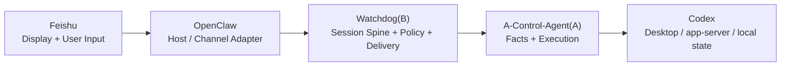
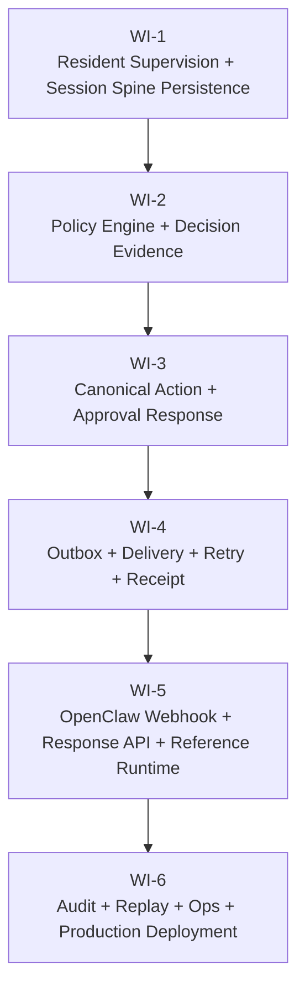

# OpenClaw × Codex Watchdog Full Product Loop 总设计

- 状态：Frozen for WI decomposition
- 日期：2026-04-07
- 对应主题：`Full Product Loop`
- 关联真值：
  - `openclaw-codex-watchdog-prd.md`
  - `docs/architecture/openclaw-codex-watchdog-g0-and-v010-design.md`
  - `specs/022-stable-session-facts/spec.md`
  - `specs/023-codex-client-openclaw-route-template/spec.md`

## 1. 设计目的

截至 `023`，本仓库已经完成：

1. `A-Control-Agent(A)` 对本机 Codex 会话的真实读取与最小控制闭环；
2. `Watchdog(B)` 面向 OpenClaw 的 stable session spine、stable facts、stable explanations、stable action/read surface；
3. OpenClaw 可直接复用的 HTTP 路由模板与接入参数收敛。

但当前形态仍然是 **stable spine / query+action MVP**，还不是你要求的最终产品闭环。明显缺口包括：

- 任务阻塞、待办、暂停、等待建议时，还没有常驻的主动提醒链路；
- 自动决策、人工升级、审批闭环与事后通知，还没有被收成可执行策略；
- OpenClaw 侧目前只有模板化接法，没有稳定 webhook / response contract 与 reference runtime；
- 公网入口、可靠投递、审计、回放、运维与生产化仍停留在“能跑”，不是“可长期运营”。

这份总设计的唯一目标固定为：

> 把当前 `A-Control-Agent(A) + Watchdog(B) + OpenClaw + Feishu` 从 stable spine 形态升级成“默认自治、例外升级、主动通知、可审计、可生产化”的完整产品闭环。

## 2. 系统边界

本轮边界冻结为：

- **Feishu**：只负责把消息展示给用户，并把用户输入回传给 OpenClaw。
- **OpenClaw**：只负责宿主适配。
  - 接收 Watchdog 主动推送的 envelope；
  - 把 envelope 渲染成 Feishu 消息；
  - 接收用户输入；
  - 把结构化响应回传给 Watchdog。
- **Watchdog(B)**：持有完整的 session spine、策略引擎、主动提醒、自动决策、人工升级、可靠投递与审计真值。
- **A-Control-Agent(A)**：只负责读取 Codex 事实与执行 continue / steer / approval callback / recovery 之类的 canonical 动作，不承担提醒编排与宿主回调。

### 2.1 A 侧边界

`A-Control-Agent(A)` 只负责：

- 原始会话与审批事实采集；
- 本机 Codex thread / turn / approval 相关 canonical 动作执行；
- 为 B 提供稳定、可鉴权的事实与动作接口。

`A-Control-Agent(A)` 不负责：

- 主动提醒；
- 自动决策；
- 飞书或 OpenClaw 渠道语义；
- 投递重试与用户升级策略。

### 2.2 B 侧边界

`Watchdog(B)` 负责：

- canonical session spine；
- 常驻监督与事实投影；
- 策略判定与决策证据包；
- 自动执行、人工升级与阻断；
- envelope 生成、可靠投递、receipt、审计与回放；
- 对 OpenClaw 的 webhook 与 response API。

### 2.3 OpenClaw 边界

OpenClaw 只负责：

- 接收 Watchdog 主动回调的 envelope；
- 按 envelope 类型渲染成 Feishu 消息；
- 接收用户输入；
- 把用户输入回传给 Watchdog 的 action / approval API。

OpenClaw 不负责：

- 决策；
- 风险分类；
- 审批文案真值；
- 自动/人工升级规则；
- 第二套状态机或第二套 session spine。

同时补充一条运行纪律：

- OpenClaw 必须被视为**弱记忆、弱纪律、可随时重启**的宿主 I/O 层；
- 任何关键状态、顺序语义、待处理事项、补发责任与恢复责任，都必须持久化在 `Watchdog(B)`，不得寄托于 OpenClaw 记忆。

## 3. 决策与升级策略

### 3.1 外部稳定决策结果

对外稳定结果只允许这三个：

- `auto_execute_and_notify`
- `require_user_decision`
- `block_and_alert`

`auto_execute` 不得作为外部稳定结果存在。若内部需要中间执行态，只能出现在运行时字段中，例如 `execution_state`，不能出现在外部稳定枚举里。

### 3.2 判定顺序

策略引擎的判定顺序固定为：

1. 先判断是否命中 `human_gate`；
2. 再判断是否命中 `hard_block`；
3. 再判断动作是否有已注册策略；
4. 只有在证据完备、风险可解释、映射完整、幂等确定时，才允许 `auto_execute_and_notify`。

总原则冻结为：

> 自动化不是 AI 主观判断，而是策略命中且证据完备才允许执行。

### 3.3 `human_gate` 与 `hard_block`

| 类别 | 默认结果 | 说明 |
|---|---|---|
| 真实外部破坏性动作 | `require_user_decision` | 例如删除、覆盖、不可逆迁移、强制关闭/重置 |
| 金钱或真实第三方资源 | `require_user_decision` | 例如付费 API、购买服务、消耗生产额度 |
| 凭证与安全边界 | `require_user_decision` | 例如读取/替换密钥、权限变更、开放公网入口 |
| 生产环境或主线风险 | `require_user_decision` | 例如合并主线、发布生产、修改线上配置 |
| 受控不确定条件 | `block_and_alert` | 不允许自动执行，也不允许继续向下游伪装成人工可放行请求 |

### 3.4 受控不确定条件

“服务自己判断不确定”不再允许写成自由文案，必须命中以下枚举之一：

- `evidence_missing`
- `fact_conflict`
- `policy_conflict`
- `action_unregistered`
- `risk_unexplainable`
- `mapping_incomplete`
  - 覆盖 `thread / approval / project` 任一映射不完整
- `idempotency_uncertain`

### 3.5 决策证据包

每次策略判定都必须落一份决策证据包，最少包含：

- `facts`
- `matched_policy_rules`
- `risk_class`
- `decision`
- `decision_reason`
- `why_not_escalated` 或 `why_escalated`
- `idempotency_key`
- `target_session / project / thread / approval ids`
- `policy_version`
- `fact_snapshot_version`

这份证据包同时服务于：

- 自动决策后的事后通知；
- 人工复盘；
- 幂等与重放；
- 后续审计与回放工具。

## 4. Envelope 契约

### 4.1 统一基座字段

三类 envelope 统一继承以下基础字段：

- `envelope_id`
- `envelope_type`
- `envelope_version`
- `correlation_id`
- `session_id`
- `project_id`
- `native_thread_id`
- `policy_version`
- `fact_snapshot_version`
- `idempotency_key`
- `audit_ref`
- `created_at`

### 4.2 结构化字段纪律

以下字段必须是结构化真值，不得退化成自由文本：

- `facts`：`FactRecord[]`
  - 每条至少包含 `fact_code`、`summary`、`refs`
- `recommended_actions`：`ActionSuggestion[]`
  - 每条至少包含 `action_code`、`label`、`action_ref`
- `decision_options`：受控枚举
  - v1 只允许 `approve`、`reject`

### 4.3 `NotificationEnvelope`

用途：面向用户的通知投递包。

专有字段：

- `event_id`
- `severity`
  - `info | warning | critical`
- `notification_kind`
  - `decision_result`
  - `stuck_alert`
  - `recovery_alert`
  - `approval_result`
  - `system_alert`
- `title`
- `summary`
- `reason`
- `facts`
- `recommended_actions`

### 4.4 `DecisionEnvelope`

用途：自动决策与执行真值。

专有字段：

- `decision_id`
- `decision_result`
  - v1 只允许 `auto_execute_and_notify`
- `execution_state`
  - `queued | dispatched | succeeded | failed`
- `action_name`
- `action_args`
- `approval_id`
- `risk_class`
- `decision_reason`
- `facts`
- `matched_policy_rules`
- `why_not_escalated`
- `completed_at`

### 4.5 `ApprovalEnvelope`

用途：人工裁决请求。

专有字段：

- `approval_id`
- `approval_kind`
  - `destructive | cost | security | production | mainline | manual_exception`
- `requested_action`
- `requested_action_args`
- `risk_class`
- `title`
- `summary`
- `decision_options`
- `facts`
- `matched_policy_rules`
- `why_escalated`
- `approval_token`
- `callback_action_ref`

### 4.6 Envelope 对齐关系

`DecisionEnvelope` 与 `NotificationEnvelope` 的关系固定为：

- `DecisionEnvelope` 是决策与执行真值；
- `NotificationEnvelope` 是面向用户通知的投递包；
- 两者通过 `decision_id + correlation_id` 关联；
- `NotificationEnvelope` 不得改写 `DecisionEnvelope` 的结论。

对外稳定结果与 envelope 的绑定关系冻结为：

| 决策结果 | 产生的 envelope |
|---|---|
| `auto_execute_and_notify` | `DecisionEnvelope` + `NotificationEnvelope(notification_kind=decision_result)` |
| `require_user_decision` | `ApprovalEnvelope` |
| `block_and_alert` | `NotificationEnvelope(severity=critical)` |

审批链路补充说明：

- `require_user_decision` 发起时只发 `ApprovalEnvelope`；
- 用户完成裁决后，再发 `NotificationEnvelope(notification_kind=approval_result)`；
- v1 不引入 `defer` 语义。

## 5. B 端常驻编排与 OpenClaw 回调闭环

### 5.1 常驻单元

`Watchdog(B)` 固定为三个常驻单元；逻辑上的 policy / execution / approval materialize 可以收敛到同一 resident orchestrator 内实现，但责任边界不得混淆：

1. `Projection Worker`
   - 持续从 `A-Control-Agent` 拉取或接收事实变化；
   - 更新 canonical session spine；
   - 生成新的 `fact_snapshot_version`。
2. `Resident Orchestrator`
   - 固定按 `session spine refresh -> policy evaluate -> auto recovery / approval materialize -> enqueue delivery -> call OpenClaw` 的链路常驻推进；
   - 对新的事实快照做策略判定；
   - 在低风险时执行 canonical action，在高风险时物化 approval；
   - 对普通进展变化生成节流后的 `progress_summary` 主动推送。
3. `Delivery Worker`
   - 把 envelope 主动回调给 OpenClaw；
   - 处理重试、去重、receipt、失败升级。

这一节同时冻结一条总原则：

- `Watchdog(B)` 必须在后台常驻推进流程；OpenClaw 只承担展示、回传与外部 I/O，不承担“记住还有什么待办”的职责。

### 5.2 顺序语义

全局允许并行；同一 `session_id` 内必须顺序消费。

顺序基准固定为：

1. `fact_snapshot_version`
2. `session_seq`
3. `outbox_seq`

`created_at` 只做展示和审计，不参与稳定排序。

### 5.3 决策与投递去重

决策层引入稳定键 `decision_key`，推荐组成：

- `session_id`
- `fact_snapshot_version`
- `policy_version`
- `decision_result`
- `action_ref`
- `approval_id`

规则：

- 同一 `decision_key` 只能生成一份 canonical decision；
- 重试只允许重投，不允许重判。

投递层去重使用：

- `envelope_id`

规则：

- OpenClaw 必须按 `envelope_id` 去重；
- 重试时 `envelope_id` 不变，只增加 `delivery_attempt`。

### 5.4 投递矩阵

投递顺序必须按决策结果类型分开冻结：

| 决策结果 | 产生对象 | 投递顺序 |
|---|---|---|
| `auto_execute_and_notify` | `DecisionEnvelope` + `NotificationEnvelope` | 先 `DecisionEnvelope`，再 `NotificationEnvelope(notification_kind=decision_result)` |
| `require_user_decision` | `ApprovalEnvelope` | 先只发 `ApprovalEnvelope`；用户响应后，再发 `NotificationEnvelope(notification_kind=approval_result)` |
| `block_and_alert` | `NotificationEnvelope` | 只发 `NotificationEnvelope(severity=critical)` |

outbox 边界同时冻结为：

- `decision_outbox`：持久化记录 canonical records 推导出的待投递 envelope 真值与 `outbox_seq`，不记录 HTTP attempt。
- `delivery_outbox`：持久化记录按 `envelope_id` 驱动的 delivery 状态、attempt、next retry、receipt 与 dead-letter 结果。

除上述“决策意义变化”外，系统还允许一类**节流后的普通进展推送**：

- 当 `activity_phase`、`summary`、`files_touched`、`context_pressure`、`stuck_level`、`pending_approval_count` 等用户可感知进展面发生变化时，允许生成 `NotificationEnvelope(notification_kind=progress_summary)`；
- `progress_summary` 不得替代 canonical decision / approval 语义，只用于“让宿主及时看到项目有新进展”；
- `progress_summary` 必须基于 persisted spine 差异与持久化 checkpoint 做 debounce / 去重，避免按每次轻微刷新都骚扰宿主。

### 5.5 OpenClaw Webhook

Watchdog 主动调用 OpenClaw 的固定入口冻结为：

- `POST /openclaw/v1/watchdog/envelopes`

请求头：

- `Authorization: Bearer <watchdog_to_openclaw_token>`
- `X-Watchdog-Delivery-Id: <envelope_id>`
- `X-Watchdog-Timestamp: <ts>`
- `X-Watchdog-Signature: <hmac>`

OpenClaw 成功接收后，返回体至少包含：

- `accepted = true`
- `envelope_id`
- `receipt_id`
- `received_at`

只有同时满足以下条件，才视为 delivered：

1. HTTP `2xx`
2. `accepted = true`
3. 返回体中的 `envelope_id` 与请求一致
4. 存在 `receipt_id`

否则一律按“协议不完整”处理，进入 retryable failure。

### 5.6 用户响应回流

OpenClaw 回传 Watchdog 的固定入口冻结为：

- `POST /api/v1/watchdog/openclaw/responses`

请求体至少包含：

- `envelope_id`
- `envelope_type`
- `approval_id`
- `decision_id`
- `response_action`
  - v1 只允许 `approve`、`reject`、`execute_action`
- `response_token`
- `user_ref`
- `channel_ref`
- `client_request_id`

响应幂等键固定为：

- `(envelope_id, response_action, client_request_id)`

同一幂等键重放不得重复执行审批或动作。

宿主边界同时冻结为：

- OpenClaw 只负责接收 envelope、渲染、接收用户输入、回传结构化 response。
- OpenClaw 不得重算决策、不做风险分类、不维护第二套审批状态机或 session spine。
- OpenClaw 即使丢失上下文、重启或“失忆”，系统真值也不能丢；`Watchdog(B)` 必须能依靠持久化 records 继续推进、补发或恢复待处理事项。

### 5.7 失败处理基线

完整产品闭环对“自动处理到哪一步”为止，也必须冻结：

- `context_critical / context window` 类问题，优先由 `Watchdog(B)` 通过 canonical recovery 链路自动处理；允许在同一项目内走 `resume_or_new_thread` 续跑，而不是把恢复责任交给 OpenClaw。
- 瞬时网络或下游暂时不可达，优先走 `delivery_outbox` / retry / backoff / alert，不得因一次失败直接丢失待办。
- 持续外部故障、额度耗尽、模型禁用、权限不足等非系统内可自愈问题，必须显式退化为 `block_and_alert` 或运维告警，而不是伪装成“已经自动处理成功”。

## 6. 完整产品闭环的正式 Work Items

完整产品闭环不再以单一超大 work item 推进，而是以 `1` 份总设计 + `6` 个按依赖顺序推进的正式 work items 落地。

### 6.1 WI-1：常驻监督与 Session Spine 持久化

- 目标：把现有“可查询状态”补成“常驻、可恢复、可排序”的 canonical 运行底座。
- 范围：
  - 常驻 `Projection Worker`
  - `fact_snapshot_version`
  - `session_seq`
  - 稳定状态投影
  - spine 持久化
  - restart / replay / restore
  - 为后续 resident orchestrator 暴露足够的 persisted fields，用于判断“决策意义变化”与“progress 变化”
- 非目标：
  - 不做策略判定
  - 不做自动执行
  - 不做 delivery / webhook / host runtime

### 6.2 WI-2：策略引擎与决策证据包

- 目标：把“默认自治，例外升级”变成可执行、可审计、可测试的 policy engine。
- 范围：
  - `human_gate`
  - `hard_block`
  - 受控不确定条件枚举
  - `policy_version`
  - `decision_key`
  - 决策证据包
- 非目标：
  - 不做真实动作执行
  - 不做 delivery
  - 不做宿主渲染

### 6.3 WI-3：Canonical Action / Approval Response 闭环

- 目标：把“会判断”推进到“会安全执行 / 会安全审批”。
- 范围：
  - canonical action registry
  - action policy binding
  - `ApprovalEnvelope`
  - `approval_token`
  - 用户响应回流
  - 响应幂等
  - `approve / reject / execute_action`
- 非目标：
  - 不做 delivery retry
  - 不做宿主展示语义
  - 不做渠道投递判定

### 6.4 WI-4：Outbox / Delivery / Retry / Receipt

- 目标：把主动消息变成真正可靠的投递系统。
- 范围：
  - `decision_outbox`
  - `delivery_outbox`
  - `outbox_seq`
  - `Delivery Worker`
  - retry / receipt / 去重 / 死信升级
- 非目标：
  - 不做业务决策
  - 不做 action / approval 业务判定
  - 不做宿主卡片语义

### 6.5 WI-5：OpenClaw Webhook / Response API / Reference Runtime

- 目标：把 OpenClaw 接入从口头说明收成稳定契约与宿主模板。
- 范围：
  - `POST /openclaw/v1/watchdog/envelopes`
  - `POST /api/v1/watchdog/openclaw/responses`
  - webhook 鉴权与签名
  - receipt 协议
  - envelope 到 Feishu 展示映射规范
  - 最小 OpenClaw reference runtime / template
- 非目标：
  - 不做业务策略
  - 不做第二套状态机
  - 不做第二个 Watchdog 内核
  - 不做 SRE / 运维面

### 6.6 WI-6：审计、回放、运维与生产部署

- 目标：把当前“能跑”补成“可长期运营”。
- 范围：
  - canonical records 审计查询
  - 基于 `decision_id / envelope_id / approval_id / receipt_id` 的 forensic replay
  - `GET /healthz`、`GET /metrics`、`GET /api/v1/watchdog/ops/alerts`
  - 五类冻结运维告警：`approval_pending_too_long`、`blocked_too_long`、`delivery_failed`、`mapping_incomplete`、`recovery_failed`
  - install / upgrade / rollback / secret rotation / 公网标准方案
  - 可执行的服务启动、重启与开机自启基线，例如 `launchd` 模板与安装脚本
  - operator runbook / production deployment
- 非目标：
  - 不反向重写前五个 WI 已冻结的核心契约

当前已交付的 WI-6 责任边界：

- 审计与 replay 只消费 `policy_decisions.json`、`canonical_approvals.json`、`delivery_outbox.json`、`action_receipts.json` 等 canonical records。
- ops surface 只回答“系统是否退化、哪些告警在亮、值班先查哪里”，不承载新的业务策略。
- 部署文档与脚本同时冻结安装、升级、回滚、密钥轮换、服务重启、开机自启与公网入口纪律，不引入新的业务行为。

### 6.7 依赖顺序

两条纪律同时冻结：

- `WI-3` 只拥有 canonical action / approval execution 语义，不拥有 delivery 重试逻辑。
- `WI-5` 的 reference runtime 只是宿主模板，不得演化成第二个 Watchdog 内核。

## 7. 当前实现状态

`WI-1 -> WI-6` 当前已按依赖顺序落地到仓库：

1. `WI-1` resident supervision + session spine persistence
2. `WI-2` policy engine + decision evidence
3. `WI-3` canonical action + approval response
4. `WI-4` outbox + delivery + retry + receipt
5. `WI-5` OpenClaw webhook / response contract + reference runtime
6. `WI-6` audit + replay + ops + production deployment

补充说明：

- 当前实现已经把 resident orchestrator、`progress_summary` 主动推送、`launchd` 开机自启安装脚本一起落库；
- 这几项不是对 OpenClaw 边界的放宽，反而是为了进一步收紧“OpenClaw 只是 I/O 宿主”的系统纪律。

后续新增需求若触碰前五个 WI 的冻结契约，应作为新 work item 或 defect 处理，而不是在 `029` 中回写边界。
