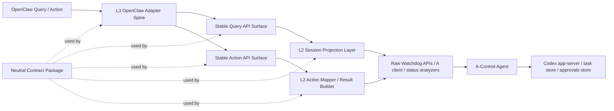

# OpenClaw × Codex Watchdog G0 总设计与 V010 冻结设计

- 状态：Frozen for spec/plan/tasks
- 日期：2026-04-05
- 对应工作项：`010-openclaw-integration-spine`
- 对应主题：`OpenClaw Integration Spine`
- 目标契约版本：`watchdog-session-spine/v1alpha1`
- 目标 schema 版本：`2026-04-05.010`
- 关联真值：
  - `openclaw-codex-watchdog-prd.md`
  - `specs/001-openclaw-codex-watchdog/spec.md`
  - `specs/005-m4-recovery/spec.md`
  - `specs/008-codex-live-control-plane/spec.md`
  - `specs/009-task-events-stream/spec.md`

## 1. 设计目的

截至 2026-04-05，本仓库已经完成：

1. `008`：A-Control-Agent 到本机 Codex live session 的真实控制闭环。
2. `009`：A-Control-Agent 与 Watchdog 侧的基础 SSE 任务事件流。

但对 OpenClaw 来说，当前仍缺一层真正可长期演进的**稳定集成脊柱**。现有能力更多仍是：

- A-Control-Agent 的原始任务对象与审批对象；
- Watchdog 的 `progress / evaluate / approvals / recover / events` 原子接口；
- 面向当前实现的字段形状，而不是面向 OpenClaw 的中立稳定契约。

`010-openclaw-integration-spine` 的唯一目标固定为：

> 建立 OpenClaw 可稳定消费的会话监管骨架，完成 `intent -> session projection / watchdog action -> reply model` 的最小可用闭环，而非实现完整实时监管与自动恢复体系。

这份 G0 的任务，不是追求“功能更多”，而是把 **Section 2 / Section 4 已冻结的边界**重新钉正：

- 恢复**中立 contract 包 + L2 投影层 + L3 独立 adapter spine**；
- 恢复**通用动作模型 `WatchdogAction -> WatchdogActionResult`**；
- 恢复此前已冻结的关键契约对象与字段，而不是退回实现导向 DTO。

## 2. G0 冻结结论

G0 的核心结论只有六条：

1. **010 不是 Watchdog 内的一个 `openclaw` 子服务，而是“中立 contract 包 + L2 投影层 + L3 独立 adapter spine”。**
2. **OpenClaw 只消费 Watchdog 的 stable contract，不直接消费 A-Control-Agent raw task schema，也不直连 SSE / recover / approvals raw 接口。**
3. **写动作的规范主面必须是 `WatchdogAction -> WatchdogActionResult`；路径级动作路由最多只是别名包装，不是 canonical contract。**
4. **010 的最小闭环必须保留 `request_recovery`，并显式处理 `why_stuck / explain_blocker`，不能无声降级出 scope。**
5. **`request_recovery` 在 010 中只返回“恢复可用性说明”，不得顺手升级成 handoff / resume / auto recover 执行器。**
6. **完整实时事件覆盖、常驻 supervisor、全量自动恢复、飞书/渠道 runtime 以及任何跨层偷实现，继续留在 010 之外。**

## 3. G0 分层



### 3.1 Contract Package

中立 contract 包是 010 的第一落点。它：

- 不使用 `openclaw` 命名；
- 不携带飞书或渠道 runtime 语义；
- 只冻结 OpenClaw 与 Watchdog 之间长期稳定的对象、枚举、版本字段和动作模型。

推荐模块落点：

- `src/watchdog/contracts/session_spine/enums.py`
- `src/watchdog/contracts/session_spine/models.py`
- `src/watchdog/contracts/session_spine/versioning.py`

### 3.2 L2 Session Projection Layer

L2 是 Watchdog 内部的稳定投影层，负责把现有 raw 能力压缩成中立 contract：

- raw task / approval / audit / supervision signal
- `evaluate_stuck(...)` 的结果
- A-Control-Agent 可达性与线程映射状态

L2 输出只允许是：

- `SessionProjection`
- `TaskProgressView`
- `FactRecord[]`
- `ApprovalProjection[]`
- `WatchdogActionResult`

### 3.3 L3 OpenClaw Adapter Spine

L3 是独立 adapter spine，不是 Watchdog 核心的一部分。它：

- 只做 `intent_code -> stable query/action -> ReplyModel` 映射；
- 只消费中立 contract 与 stable API；
- 不直连 A-Control-Agent；
- 不接 SSE；
- 不接飞书 / 渠道消息 runtime；
- 不定义新的内核状态。

推荐模块落点：

- `src/watchdog/services/adapters/openclaw/intents.py`
- `src/watchdog/services/adapters/openclaw/reply_model.py`
- `src/watchdog/services/adapters/openclaw/adapter.py`

### 3.4 Raw / Legacy Interfaces

以下接口在 010 中继续存在，但它们只作为内部依赖或 legacy API：

- `GET /api/v1/watchdog/tasks/{project_id}/progress`
- `POST /api/v1/watchdog/tasks/{project_id}/evaluate`
- `GET /api/v1/watchdog/approvals`
- `POST /api/v1/watchdog/approvals/{approval_id}/decision`
- `POST /api/v1/watchdog/tasks/{project_id}/recover`
- `GET /api/v1/watchdog/tasks/{project_id}/events`

它们都**不是** OpenClaw 的 canonical stable contract。

## 4. V010 冻结范围

### 4.1 In Scope

010 只覆盖以下最小范围：

1. 最小稳定对象与受控枚举落地。
2. 中立 contract 包。
3. Watchdog 中的 L2 稳定投影层。
4. OpenClaw 的 L3 adapter spine。
5. 最小 intent 集与 reply 集。
6. 以 `WatchdogAction -> WatchdogActionResult` 为主的最小稳定动作面。
7. 对应契约测试、适配层测试、最小集成测试。
8. 动作版本化与最小幂等语义。

### 4.2 Out of Scope

010 明确排除：

1. 完整实时事件覆盖。
2. 常驻 supervisor。
3. 全量自动恢复闭环。
4. 飞书或其他渠道运行时代码。
5. 任何跨层偷实现。
6. 针对 `request_recovery` 的真实 handoff / resume 执行动作。

## 5. 稳定契约对象

010 不再把 stable contract 缩成三个实现导向 DTO，而是冻结以下七类对象。

### 5.1 版本语义

所有 stable contract 都必须明确区分：

- `contract_version`
  - 语义版本，表示“这是一套什么契约”。
  - 010 冻结值：`watchdog-session-spine/v1alpha1`
- `schema_version`
  - 结构版本，表示“这次 payload 采用哪一版字段集”。
  - 010 冻结值：`2026-04-05.010`

`source_version: "v010"` 这类示意字段不再作为正式契约字段。

### 5.2 `SessionProjection`

`SessionProjection` 表示“项目会话在当前时刻的稳定身份与生命周期快照”。

建议字段：

```json
{
  "contract_version": "watchdog-session-spine/v1alpha1",
  "schema_version": "2026-04-05.010",
  "project_id": "ai-sdlc-main",
  "thread_id": "thr_project_anchor_001",
  "native_thread_id": "codex_native_thr_8f3",
  "session_state": "active",
  "activity_phase": "executing",
  "attention_state": "normal",
  "headline": "正在补测试并等待下一次 continue 决策。",
  "pending_approval_count": 0,
  "available_intents": [
    "get_session",
    "get_progress",
    "why_stuck",
    "explain_blocker",
    "list_pending_approvals",
    "continue_session",
    "request_recovery"
  ],
  "last_progress_at": "2026-04-05T05:20:00Z",
  "last_action_at": "2026-04-05T05:21:00Z"
}
```

字段语义：

- `thread_id`
  - 会话级稳定线程锚点，面向 project 语义。
- `native_thread_id`
  - 底层本机 Codex thread 引用，可为空。
  - handoff / resume / native thread 注册后，它可能与 `thread_id` 不再等价。

### 5.3 `TaskProgressView`

`TaskProgressView` 表示“当前执行进展、信号与可解释事实”。

建议字段：

```json
{
  "contract_version": "watchdog-session-spine/v1alpha1",
  "schema_version": "2026-04-05.010",
  "project_id": "ai-sdlc-main",
  "thread_id": "thr_project_anchor_001",
  "native_thread_id": "codex_native_thr_8f3",
  "activity_phase": "executing",
  "summary": "已修改 close_check.py，正在补充回归测试。",
  "files_touched": [
    "src/ai_sdlc/core/close_check.py",
    "tests/unit/test_close_check.py"
  ],
  "context_pressure": "medium",
  "stuck_level": 1,
  "primary_fact_codes": [],
  "blocker_fact_codes": [],
  "last_progress_at": "2026-04-05T05:20:00Z"
}
```

### 5.4 `FactRecord`

`FactRecord` 是稳定解释原子，供 `why_stuck`、`explain_blocker`、`request_recovery` 与后续渠道渲染复用。

建议字段：

```json
{
  "contract_version": "watchdog-session-spine/v1alpha1",
  "schema_version": "2026-04-05.010",
  "fact_id": "fact_001",
  "fact_code": "approval_pending",
  "fact_kind": "blocker",
  "severity": "needs_human",
  "summary": "当前存在待人工审批命令。",
  "detail": "命令风险等级为 L2，未决策前不会继续执行。",
  "source": "approval_store",
  "observed_at": "2026-04-05T05:22:00Z",
  "related_ids": {
    "approval_id": "appr_001"
  }
}
```

010 至少冻结以下 `fact_code`：

- `approval_pending`
- `stuck_no_progress`
- `repeat_failure`
- `control_link_error`
- `context_critical`
- `recovery_available`
- `recovery_blocked`
- `awaiting_human_direction`

### 5.5 `ApprovalProjection`

`ApprovalProjection` 是稳定审批对象。

建议字段：

```json
{
  "contract_version": "watchdog-session-spine/v1alpha1",
  "schema_version": "2026-04-05.010",
  "approval_id": "appr_001",
  "project_id": "ai-sdlc-main",
  "thread_id": "thr_project_anchor_001",
  "native_thread_id": "codex_native_thr_8f3",
  "risk_level": "L2",
  "command": "uv pip install -r requirements-dev.txt",
  "reason": "需要安装测试依赖",
  "alternative": "仅输出缺失依赖列表",
  "status": "pending",
  "requested_at": "2026-04-05T05:25:00Z"
}
```

### 5.6 `WatchdogAction`

`WatchdogAction` 是 stable write contract 的 canonical request。

建议字段：

```json
{
  "contract_version": "watchdog-session-spine/v1alpha1",
  "schema_version": "2026-04-05.010",
  "action_code": "continue_session",
  "project_id": "ai-sdlc-main",
  "approval_id": null,
  "operator": "openclaw",
  "idempotency_key": "act_ai_sdlc_main_continue_20260405_001",
  "arguments": {},
  "note": "用户要求继续推进一次"
}
```

010 只冻结四个 `action_code`：

- `continue_session`
- `request_recovery`
- `approve_approval`
- `reject_approval`

### 5.7 `WatchdogActionResult`

`WatchdogActionResult` 是 stable write contract 的 canonical response。

建议字段：

```json
{
  "contract_version": "watchdog-session-spine/v1alpha1",
  "schema_version": "2026-04-05.010",
  "action_code": "request_recovery",
  "project_id": "ai-sdlc-main",
  "approval_id": null,
  "idempotency_key": "act_ai_sdlc_main_recover_20260405_001",
  "action_status": "completed",
  "effect": "advisory_only",
  "reply_code": "recovery_availability",
  "message": "当前可进入恢复建议路径，但 010 不执行 handoff / resume。",
  "session": null,
  "facts": [
    {
      "fact_code": "recovery_available"
    }
  ],
  "error": null
}
```

`action_status` 受控枚举：

- `accepted`
- `completed`
- `noop`
- `blocked`
- `rejected`
- `failed`

`effect` 受控枚举：

- `state_changed`
- `advisory_only`
- `no_effect`

### 5.8 `ReplyModel`

`ReplyModel` 是 L3 adapter 的统一输出，不再只靠 `reply_kind` 一维表达。

建议字段：

```json
{
  "contract_version": "watchdog-session-spine/v1alpha1",
  "schema_version": "2026-04-05.010",
  "reply_kind": "explanation",
  "reply_code": "stuck_explanation",
  "intent_code": "why_stuck",
  "message": "当前主要卡点是待审批命令未决。",
  "session": null,
  "progress": null,
  "approvals": null,
  "action_result": null,
  "facts": [
    {
      "fact_code": "approval_pending"
    }
  ]
}
```

`reply_kind` 只做粗分类：

- `view`
- `explanation`
- `action_result`
- `error`

`reply_code` 才是稳定语义主键。010 至少冻结：

- `session_projection`
- `task_progress_view`
- `stuck_explanation`
- `blocker_explanation`
- `approval_queue`
- `approval_result`
- `action_result`
- `recovery_availability`
- `control_link_error`
- `unsupported_intent`

## 6. 受控枚举与映射

### 6.1 `session_state`

- `active`
- `awaiting_approval`
- `blocked`
- `recovering`
- `completed`
- `failed`
- `unavailable`

建议映射：

| Raw task status / 链路状态 | Stable `session_state` |
|---|---|
| `running`, `created`, `waiting_for_direction`, `resuming` | `active` |
| `waiting_for_approval` 或 pending approval 存在 | `awaiting_approval` |
| `stuck`, `paused`, 明确 blocker 未解 | `blocked` |
| handoff / resume 正在进行 | `recovering` |
| `completed` | `completed` |
| `failed` | `failed` |
| A 不可达 / envelope 异常 | `unavailable` |

### 6.2 `activity_phase`

- `planning`
- `executing`
- `validating`
- `handoff`
- `unknown`

建议映射：

| Raw phase | Stable `activity_phase` |
|---|---|
| `planning`, `code_reading` | `planning` |
| `editing_source`, `editing_tests`, `debugging` | `executing` |
| `running_tests`, `summarizing` | `validating` |
| `handoff` | `handoff` |
| 其他 / 缺失 | `unknown` |

### 6.3 `attention_state`

- `normal`
- `needs_attention`
- `needs_human`
- `critical`
- `unreachable`

建议映射：

| Signal | Stable `attention_state` |
|---|---|
| 正常推进 | `normal` |
| stuck level 升高 / failure_count 升高 | `needs_attention` |
| pending approval / 等待人工方向 | `needs_human` |
| `context_pressure == critical` / 恢复建议触发 | `critical` |
| A 不可达 | `unreachable` |

## 7. L2 稳定投影层

L2 不是“把 raw 结果重新包一层”而已，它负责做稳定归并。

### 7.1 可读取输入

L2 允许读取：

1. A-Control-Agent `task` envelope。
2. A-Control-Agent approvals 列表与审批对象。
3. `evaluate_stuck(...)` 的分析输出。
4. 线程映射与 native thread 注册信息。
5. Watchdog 的控制链路健康状态。

### 7.2 必须产出的稳定解释

L2 至少要能稳定生成：

1. 会话身份快照：`SessionProjection`
2. 进展快照：`TaskProgressView`
3. 事实原子：`FactRecord[]`
4. 审批快照：`ApprovalProjection[]`

### 7.3 `why_stuck` 与 `explain_blocker`

这两个 intent 不再是“随便拼 message”的渠道行为，而是读取 L2 产出的稳定事实：

- `why_stuck`
  - 读取 `FactRecord[fact_kind in {signal, blocker}]`
  - 输出主要 stuck reason 与 supporting facts
- `explain_blocker`
  - 读取 `FactRecord[fact_kind == blocker]`
  - 输出 blocker summary、detail 与 related ids

### 7.4 `request_recovery`

010 恢复 `request_recovery`，但严格限定为**可用性说明**：

- 允许检查：
  - `context_pressure`
  - `session_state`
  - `thread_id / native_thread_id`
  - A-Control-Agent 可达性
  - 是否存在 handoff / resume 前提
- 不允许执行：
  - handoff
  - resume
  - 新线程续跑
  - 自动恢复编排

输出必须表现为：

- `WatchdogActionResult.effect = advisory_only`
- `WatchdogActionResult.reply_code = recovery_availability`

## 8. 最小 intent 集与 reply 集

### 8.1 In-Scope Intents

| Intent | 类型 | 说明 |
|---|---|---|
| `get_session` | read | 读取 `SessionProjection` |
| `get_progress` | read | 读取 `TaskProgressView` |
| `why_stuck` | explain | 基于 `FactRecord` 输出 stuck explanation |
| `explain_blocker` | explain | 基于 `FactRecord` 输出 blocker explanation |
| `list_pending_approvals` | read | 读取 `ApprovalProjection[]` |
| `continue_session` | write | 触发一次最小 continue 路径 |
| `request_recovery` | write-advisory | 只返回恢复可用性说明 |
| `approve_approval` | write | 通过审批 |
| `reject_approval` | write | 拒绝审批 |

### 8.2 Out-of-Scope Intents

以下不进入 010：

- `pause_session`
- `resume_session`
- `stream_events`
- `force_handoff`
- `retry_with_conservative_path`
- 任何 supervisor / auto recover / channel runtime intent

### 8.3 In-Scope Reply Codes

| `reply_kind` | `reply_code` | 用途 |
|---|---|---|
| `view` | `session_projection` | 返回 `SessionProjection` |
| `view` | `task_progress_view` | 返回 `TaskProgressView` |
| `explanation` | `stuck_explanation` | 返回 why_stuck 结果 |
| `explanation` | `blocker_explanation` | 返回 explain_blocker 结果 |
| `view` | `approval_queue` | 返回待审批列表 |
| `action_result` | `action_result` | continue 等一般动作 |
| `action_result` | `approval_result` | approve / reject 结果 |
| `action_result` | `recovery_availability` | recovery advisory only |
| `error` | `control_link_error` | A 不可达 / 链路失败 |
| `error` | `unsupported_intent` | adapter 不支持的 intent |

## 9. 最小稳定 API 面

010 设计的 stable API 只面向 OpenClaw 集成骨架，不替代现有 raw API。

### 9.1 传输外壳

HTTP 传输层仍可复用当前仓库 `ok(...) / err(...)` envelope：

- `success`
- `request_id`
- `data`
- `error`
- `ts`

但对于 OpenClaw 来说：

- read 接口的 `data` 必须是 `ReplyModel`
- write 接口的 `data` 必须是 `WatchdogActionResult`

外层 envelope 只负责 transport；真正 stable semantic contract 是内层对象。

### 9.2 Canonical Read Routes

- `GET /api/v1/watchdog/sessions/{project_id}`
  - 返回 `ReplyModel(reply_code=session_projection)`
- `GET /api/v1/watchdog/sessions/{project_id}/progress`
  - 返回 `ReplyModel(reply_code=task_progress_view)`
- `GET /api/v1/watchdog/sessions/{project_id}/pending-approvals`
  - 返回 `ReplyModel(reply_code=approval_queue)`

`why_stuck` 与 `explain_blocker` 在 010 中不强制单独暴露 HTTP 路由；L3 adapter 可以基于上面 read model 输出稳定 explanation reply，但不得读取 raw API。

### 9.3 Canonical Write Route

- `POST /api/v1/watchdog/actions`
  - 请求体：`WatchdogAction`
  - 返回：`WatchdogActionResult`

这是 010 唯一冻结的 canonical write contract。

### 9.4 Human-Friendly Alias Routes

为了便于集成，可提供以下 alias route，但它们都必须内部转成同一个 `WatchdogAction`：

- `POST /api/v1/watchdog/sessions/{project_id}/actions/continue`
- `POST /api/v1/watchdog/sessions/{project_id}/actions/request-recovery`
- `POST /api/v1/watchdog/approvals/{approval_id}/approve`
- `POST /api/v1/watchdog/approvals/{approval_id}/reject`

这些 alias route：

- 不是 canonical contract；
- 不得各自发展成不同的结果模型；
- 不得绕过统一幂等处理。

### 9.5 幂等语义

010 必须补回最小幂等设计：

1. 所有 write action 都带 `idempotency_key`。
2. 相同 `(action_code, project_id, approval_id, idempotency_key)` 重试时，返回相同 `WatchdogActionResult` 或稳定 `noop` 结果。
3. `continue_session`、`approve_approval`、`reject_approval`、`request_recovery` 都适用。
4. 幂等收据存储属于 Watchdog 自身职责，不得下沉到 OpenClaw adapter。

## 10. 010 最小动作闭环

### 10.1 `continue_session`

010 保留“最小安全 continue”：

- 优先复用现有 `evaluate -> steer` 链路；
- 允许返回 `accepted / noop / blocked`；
- 不升级成完整自动恢复或后台策略引擎。

### 10.2 `request_recovery`

010 只返回：

- 当前是否具备恢复建议条件；
- 为什么可恢复 / 不可恢复；
- 建议使用何种后续动作。

010 不执行：

- `POST .../recover`
- `handoff`
- `resume`
- 新线程续跑

### 10.3 审批动作

`approve_approval` 与 `reject_approval`：

- 仍可复用现有 A-Control-Agent decision 路径；
- 但对 OpenClaw 暴露的必须是 `WatchdogActionResult` / `ReplyModel(reply_code=approval_result)`；
- 不再直接透传 raw approval decision envelope。

## 11. 测试冻结要求

010 的测试必须跟着 stable contract 走，而不是只测 raw API。

### 11.1 Contract Tests

验证：

1. `contract_version / schema_version` 必然存在。
2. `SessionProjection`、`TaskProgressView`、`FactRecord`、`ApprovalProjection`、`WatchdogAction`、`WatchdogActionResult`、`ReplyModel` 字段集稳定。
3. `thread_id / native_thread_id` 语义不混淆。
4. `reply_code`、`action_code`、`action_status`、`effect` 枚举输出域正确。

### 11.2 Projection Tests

验证：

1. raw task / approval / stuck signal 能映射到稳定投影。
2. `why_stuck` 与 `explain_blocker` 的解释来自 `FactRecord`。
3. `request_recovery` 只产出 advisory facts，不触发 side effect。

### 11.3 Adapter Tests

验证：

1. L3 adapter 只接受冻结 intent。
2. adapter 只消费 stable contract / stable API。
3. `ReplyModel.reply_code` 正确区分 `stuck_explanation`、`blocker_explanation`、`recovery_availability` 等语义。
4. 未支持 intent 明确返回 `unsupported_intent`。

### 11.4 Minimal Integration Tests

验证：

1. `continue_session` 成功路径映射到统一 `WatchdogActionResult`。
2. `continue_session` 阻塞路径返回稳定 `blocked` / `noop`。
3. `request_recovery` 返回 advisory only。
4. `approve_approval` / `reject_approval` 形成稳定闭环。
5. A 不可达时返回 `control_link_error`，而不是 transport-only 错误。

## 12. 模块落点冻结

### 12.1 Contract Package

- `src/watchdog/contracts/session_spine/enums.py`
- `src/watchdog/contracts/session_spine/models.py`
- `src/watchdog/contracts/session_spine/versioning.py`

### 12.2 L2 Projection / Action Mapping

- `src/watchdog/services/session_spine/facts.py`
- `src/watchdog/services/session_spine/projection.py`
- `src/watchdog/services/session_spine/actions.py`

### 12.3 Stable API Surface

- `src/watchdog/api/session_spine_queries.py`
- `src/watchdog/api/session_spine_actions.py`
- `src/watchdog/storage/action_receipts.py`

### 12.4 L3 Adapter Spine

- `src/watchdog/services/adapters/openclaw/intents.py`
- `src/watchdog/services/adapters/openclaw/reply_model.py`
- `src/watchdog/services/adapters/openclaw/adapter.py`

### 12.5 Legacy / Raw APIs

以下模块继续保留，但不承担 stable contract 角色：

- `src/watchdog/api/progress.py`
- `src/watchdog/api/supervision.py`
- `src/watchdog/api/approvals_proxy.py`
- `src/watchdog/api/recover_watchdog.py`
- `src/watchdog/api/events_proxy.py`

## 13. 明确禁止事项

010 不允许：

1. 把 stable contract 放回 `src/watchdog/services/openclaw/*`。
2. 让路径级动作路由取代 `WatchdogAction -> WatchdogActionResult`。
3. 无声删掉 `request_recovery`、`why_stuck` 或 `explain_blocker`。
4. 用 `reply_kind` 单字段替代 `reply_code`。
5. 把 `thread_id` 与 `native_thread_id` 混成一个字段。
6. 把 `request_recovery` 偷扩成真实恢复执行器。
7. 在 adapter 层直接做飞书 / 渠道 runtime 逻辑。

## 14. V010 完成标准

只有当以下条件同时满足，010 才算达标：

1. OpenClaw 面向的是中立 contract 包，而不是 Watchdog 内部 `openclaw` 子服务。
2. stable read / write contract 已明确区分于 raw / legacy API。
3. `WatchdogAction -> WatchdogActionResult` 已成为 canonical write surface。
4. `request_recovery`、`why_stuck`、`explain_blocker` 已被明确纳入并定边界。
5. `FactRecord`、`TaskProgressView`、`ReplyModel.reply_code`、`thread_id / native_thread_id`、`contract_version / schema_version` 都已冻结。
6. 文档、任务和测试口径都围绕上述契约，而不是围绕简化后的路径动作 DTO。

## 15. 结论

G0 与 V010 的价值，不是交付更多功能，而是先把后续演进的接缝做对：

1. `011+` 若扩展实时事件，应扩在 stable contract 旁边，而不是回流污染 010。
2. `011+` 若扩展真实恢复执行，可在 `request_recovery` 之外新增更高层动作，而不是改写 010 的 advisory contract。
3. 多渠道接入应复用同一组中立 contract 与 `FactRecord`，而不是把渠道语义塞回 Watchdog 内核。

因此，010 的正确形态应当是：

**中立 contract 包 + L2 稳定投影层 + L3 独立 adapter spine + 通用动作模型 + 版本化 / 幂等的最小闭环。**
